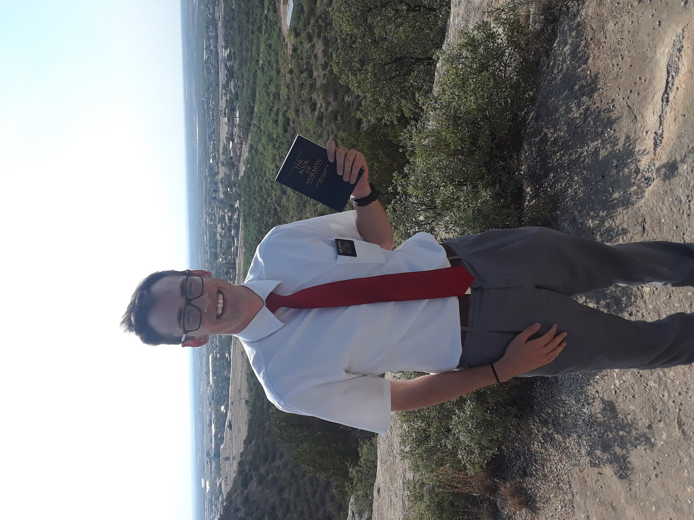

# I Used to be Mormon

It wasn’t going to go away, no matter how much I tried not to think about it. The thought had taken permanent residence on a shelf in my brain titled: *Future Problems*. It was a future problem that was fast approaching, like a knife wielding horror cliche chasing me in the forest, who just now broke out into a sprint.

I was having trouble describing what I was feeling. It was a kind of fear mixed with uncertainty? And then pan tossed with insecurity? Is this what anxiety felt like? Wasn’t I just in High School? Wasn’t graduation only a month ago? I had already said goodbye to my graduating class, and now I have to say goodbye to my friends and family?

<!-- more -->
I looked down at the floor where all of my belongings lie, then to the empty closet where they were just a moment ago. My bed sank as I sat on the edge of it, seemingly burdened by the extra weight of my thoughts. My room was suddenly a mess. Maybe if I sat and stared at my stuff for long enough, it would magically pack itself, or better yet, it’d go back into the closet where it's always been. This wishful thinking was interrupted by my mom, who has walked into my room to ask me a question.

*“How’s the packing coming along?”*

I open my mouth to speak but nothing comes out. Just one word would do the trick; good, or fine, or even bad would suffice. No need to make a scene.

Suddenly I’m crying.

This catches me off guard, as I had never cried from fear and stress before. It’s also extremely uncharacteristic of me to cry in front of my mom like this. My mom knows this too. Clearly sensing something was off, she tried to comfort me.

*“You know you don’t have to go if you don’t want to.”*

I looked at her for a minute wondering if she actually believed what she just said. All this work to get to this point just to back out at the last second? All of the worthiness tests and the bishopric meetings and the priesthood blessings and the tithing money paid just so I could go to college for a year? No, it’s too late to turn back.

I’m going to be a Mormon missionary for 2 years of my life.

After I assured my mom that everything was fine, she left. Then I placed all my things into my comically large suitcase. It’s a strange thing, living out of a suitcase for 2 years, constantly moving from place to place, never really having somewhere to call home. Just drifting in and out of people's stories without a care in the world. Why fully unpack your things when you’re just going to have to move again? Then again, why even think about unpacking a suitcase right now? I just *finished* packing. There’s a million things I still needed to get done, yet all I could seem to muster the energy to do was sit on the edge of my bed and stare at my suitcase.

What I’m describing isn’t unique; thousands of people decide to go on missions every year. You're treated with honor and respect, and you return home a local hero. God has commanded to go and teach the world the truth. We sing about this moment in church when we're children. *I hope they call me on a mission, when I have grown a foot or two*. People do this kind of thing because they genuinely believe in what they’re teaching.

{ width="24%" align="right" }

I went on a mission because I believed in the Mormon church. I believed, perhaps naively, that the Mormon church was the only true church on the planet. I taught people about Joseph Smith. I baptized people. I knocked on lots and lots of doors. I listened to cheesy Christian bands. I handed out the Book of Mormon. I called my family twice a year. I prayed every night. I went to bed at 10:30. I got 8 hours of sleep. I played a lot of basketball. I wrote in my journal.

I was a good Mormon missionary.

Growing up we were taught that people who stop believing are “deceived by Satan” or “fell for anti-Mormon literature” or “were lazy and just wanted to sin” or “were offended by the people” etc, etc…

So then did any of those things happen to me?

No.

**I left because the Mormon church isn’t true.**

They’ll tell you about all of these "reasons" that people leave to try and discredit the people who left. The truth is, in order to honestly comprehend that people leave the Mormon church because of flaws in it's history or doctrine, means admitting that those flaws exist in the first place. The Mormon church, however, has no flaws, at least according to them.

I’ll never forget the time I found out the Mormon church lied to me.

*“There’s no way an uneducated farm boy could write such a complicated and convincing tale as the Book of Mormon in only 60 days! It had to have come from God!”*

You’ll hear this argument a lot. I have heard this argument more times than I can count. I *told* this to people while on my mission.

I would like to now turn your attention away from the Book of Mormon briefly, and towards a different book, in a different time. One that was published a decade prior to the release of the Book of Mormon. This book is titled *[The Late War](https://archive.org/details/latewarbetweenun00inhunt/page/n5/mode/2up?view=theater)*. It’s a historical textbook written in an old style of English, similar to that of the Book of Mormon. So similar, in fact, that doing a [side by side comparison](http://wordtree.org/thelatewar//) reveals a singularly laughable fact. Large swaths of the Book of Mormon were very clearly plagiarized from this book. Not only that, but this was a book that is widely believed to have been owned by Joseph Smith himself.

There I was, a struggling college student in my studio apartment, doing the side by side comparison of the two books whilst my newborn son napped in the crib behind me. My jaw hung open in disbelief as I read. ***“The single most important piece of evidence for the restoration of the gospel”*** was falling apart right in front of me. My brain broke. The glass chair I was sitting on shattered and I was suddenly falling 168 stories to my death. The world started to spin.

I know it sounds a bit hyperbolic but my whole entire belief system came crashing down. There was nothing left. I stood there in the ashes wondering what I could possibly rebuild with.

To this day my parents think I “read some anti Mormon stuff online.” We don’t really talk about it. Maybe we never will. They’ve dedicated close to half a century worth of time to the Mormon church. I was lucky enough to learn the truth in my early twenties, I can’t image what it would do to a person in their sixties. Perhaps it’s better if they never learn the truth. All their friends, large chunks of their identity, and their whole community is Mormon. Maybe they’d be too proud to listen to what I have to say. I don’t even know if I want to try to tell them.

I wanted the church to be true. I wanted the community, I miss the community. I miss knowing “what the purpose of life is.” I wanted to believe in continuing revelation and modern day prophets. I loved the beautiful bubble that was Utah county. I enjoyed going to church and singing weird cult-y songs about Joseph Smith being a Martyr. But it’s impossible to *unsee* something.

Once you pull back the curtain to reveal a man operating the levers to what you once believed moments ago was a great and powerful wizard, you can’t just close the curtain and pretend everything is fine.

**Ignorance is bliss.**
